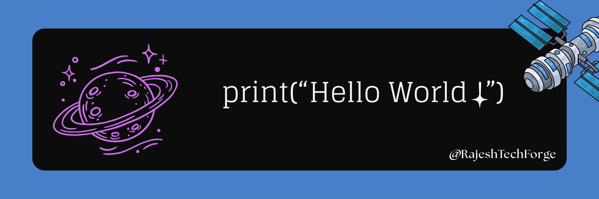

 

  
  
  

  
# 🚀 Hello, I'm Rajesh Mondal

### CSE Undergraduate | Open-Souce Enthusiast

I am a B.Tech CSE student with strong foundation in **Python**. Since 2020, I have transitioned from writing scripts to architecting open-source solutions and exploring the frontier of **Generative AI** and **Machine Learning**. I thrive at the intersection of complex logic and real-world utility.

### 🛠️ Core Focus & Expertise

* **Open-Source Development:** Architecting Python-based applications designed to solve real-world problems.
* **Artificial Intelligence:** Deep-diving into ML models and Generative AI workflows to build the next generation of intelligent tools.
* **System:** A dedicated **Arch + Hyprland** setup, with a versatile background across Ubuntu, Fedora, Pop!_OS, and Kali.
* **Collaborative Innovation:** An active contributor to the open-source ecosystem, believing that the best software is built through community and shared knowledge.

**"Turning complex problems into elegant, impactful code."**

# 🧠 Skills:

  
  
  
  

# 🔥 Stats:

